# BrainU

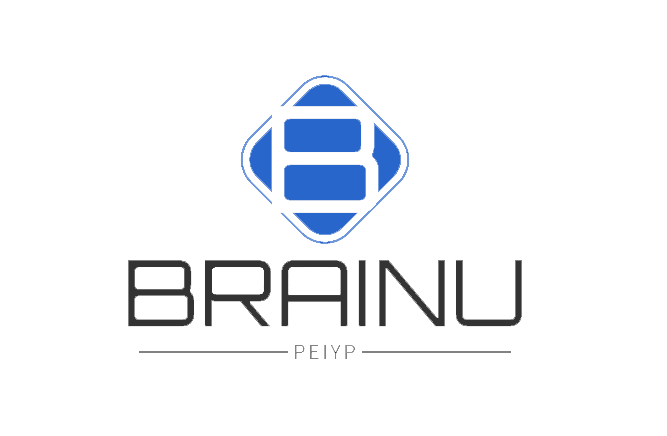

BrainU 是一个面向脑部 MRI 的肿瘤分割与医学影像浏览平台。系统由 Vue 2 临床工作台、Spring Boot 聚合服务、Python/PyTorch 推理服务以及 MySQL、Redis、MinIO 等基础设施组成，支持病例管理、MRI 文件上传、模型选择、肿瘤分割、三向切片浏览和结果下载。

> [!WARNING]
> 本项目目前属于教学、科研和工程验证性质，不是经过医疗器械认证的诊断系统，不能直接用于临床诊断或治疗决策。

> [!CAUTION]
> 仓库历史配置中存在数据库、Redis、MinIO 地址及凭据硬编码。公开部署前必须轮换相关凭据，并使用本地配置文件或环境变量覆盖，禁止继续使用仓库中出现过的任何密码。

## 目录

- [功能概览](#功能概览)
- [技术栈](#技术栈)
- [项目结构](#项目结构)
- [运行架构](#运行架构)
- [部署方式选择](#部署方式选择)
- [部署前必须确认的事项](#部署前必须确认的事项)
- [本地开发环境搭建](#本地开发环境搭建)
- [生产环境部署](#生产环境部署)
- [微服务版本说明](#微服务版本说明)
- [日常更新与回滚](#日常更新与回滚)
- [常见问题](#常见问题)
- [模型与实验结果](#模型与实验结果)

## 功能概览

- 医生账号登录与基于 JWT、Redis 的会话校验。
- 患者资料、待诊断病例和已诊断病例管理。
- 批量上传 `.mha` MRI 序列及患者资料。
- 选择 U-Net 或 Multi-modal U-Net 模型执行分割。
- 将分割结果和原始切片上传至 MinIO。
- 轴位、矢状位、冠状位和三维定位视图联动浏览。
- 当前切片按需加载，并预取相邻切片，避免一次性加载数百张图像。
- 原始影像与分割结果切换、当前切片下载、结果文件下载。
- 模型信息、医生信息和诊断通知管理。

## 技术栈

| 层级 | 技术 |
| --- | --- |
| Web 前端 | Vue 2.6、Vue Router 3、Element UI、Axios、Three.js |
| 聚合后端 | Java 8、Spring Boot 2.7.5、MyBatis-Plus 3.5、Druid |
| 推理服务 | Python、PyTorch、SimpleITK、OpenCV、NumPy |
| 数据存储 | MySQL、Redis、MinIO |
| 可选微服务 | Spring Cloud 2021、Spring Cloud Alibaba、Nacos、Gateway、OpenFeign |
| 生产入口 | Nginx、systemd（示例） |

## 项目结构

```text
BrainU/
├── README.md
├── designSystem/
│   ├── BrainU-frontend/          # Vue 2 前端
│   ├── BrainU-backend/           # 推荐使用的 Spring Boot 聚合后端
│   └── BrainU-micoservice/       # 早期微服务拆分版本，当前不建议作为首次部署入口
└── python_server/                # PyTorch 推理与切片生成服务，TCP 端口 50007
```

核心目录说明：

```text
designSystem/BrainU-frontend/src/
├── api/                          # 前端 API 封装
├── router/                       # 懒加载路由
├── util/request.js               # Axios 实例，统一请求 /api
└── views/workSpace/components/   # 医学影像查看器和 Three.js 引擎

designSystem/BrainU-backend/src/main/
├── java/com/peiyp/brainu/
│   ├── controller/               # HTTP 接口
│   ├── service/                  # 业务与 Python Socket 调用
│   ├── mapper/                   # MyBatis-Plus Mapper
│   └── config/                   # Redis、MinIO、Web 配置
└── resources/application.yml     # 默认配置，生产环境必须覆盖敏感值
```

## 运行架构

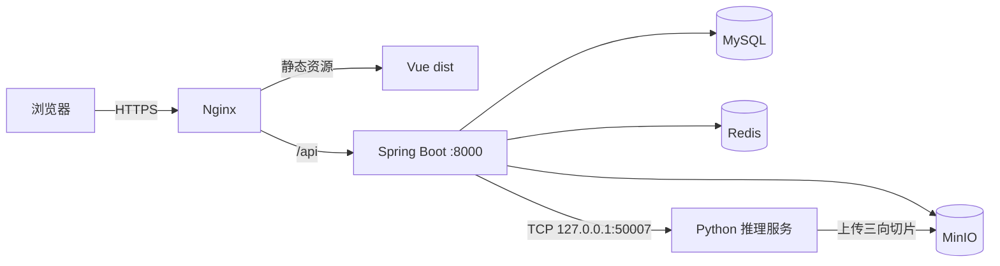

一次完整分割流程：

1. 前端把 MRI 文件和患者资料上传到 Spring Boot。
2. Spring Boot 将上传文件暂存到本机目录，并保存患者、文件和通知记录。
3. 医生在待诊断病例中选择模型并发起分割。
4. Spring Boot 通过 TCP `127.0.0.1:50007` 调用 Python 服务。
5. Python 加载模型和 MRI 数据，生成 `result.mha`。
6. Python 生成轴位、矢状位和冠状位切片，并上传至 MinIO。
7. Spring Boot 保存 MinIO 对象路径，前端按需获取预签名 URL 并浏览切片。

## 部署方式选择

仓库中存在两套 Java 后端：

### 方案 A：聚合后端，推荐

目录：`designSystem/BrainU-backend`

- 单个 Spring Boot 服务。
- 默认端口为 `8000`，上下文路径为 `/api`。
- 本地搭建、演示和当前生产化改造都应从此方案开始。
- 不依赖 Nacos 和 Gateway，故障面更小。

### 方案 B：微服务版本，实验性质

目录：`designSystem/BrainU-micoservice`

- 包含 Gateway、Auth、User、Model、TumorSegmentation、Common。
- 依赖 Nacos、OpenFeign 和多个服务进程。
- 部分模块声明、配置和硬编码地址尚未完全收口，不能直接视为一键部署版本。

下文除“微服务版本说明”外，均以方案 A 为准。

## 部署前必须确认的事项

当前代码能够展示完整设计，但还存在一些会影响首次运行或生产安全的硬编码。部署前应逐项处理。

### 1. 立即轮换历史凭据

以下文件曾包含明文连接信息：

- `designSystem/BrainU-backend/src/main/resources/application.yml`
- `designSystem/BrainU-micoservice/**/application.yml`
- `designSystem/BrainU-micoservice/**/bootstrap.properties`
- `python_server/test/saveoss.py`

即使这些凭据已经不可用，也应在数据库、Redis、MinIO 和 Nacos 侧执行轮换。不要只修改 Git 最新提交；凭据仍可能存在于 Git 历史中。

### 2. 统一 MinIO 桶名

聚合后端在 `Constants.java` 中使用桶名：

```text
brainu
```

Python 的 `saveoss.py` 旧代码使用了另一个桶名。部署时必须将 Python 中所有 `bucket_name` 统一为 `brainu`，或者同时修改 Java 常量和初始化命令，确保两端完全一致。否则 Python 上传成功后，Java 会从另一个桶生成 URL，页面将无法显示切片。

### 3. 修改 Python MinIO 配置

`python_server/test/saveoss.py` 当前直接写入 MinIO endpoint、access key 和 secret key。生产环境至少应改为读取环境变量，例如：

```python
endpoint = os.environ["BRAINU_MINIO_ENDPOINT"]
access_key = os.environ["BRAINU_MINIO_ACCESS_KEY"]
secret_key = os.environ["BRAINU_MINIO_SECRET_KEY"]
```

当前仓库尚未完成这一重构，因此仅设置环境变量不会自动生效；必须先修改 Python 代码。

### 4. 修正上传暂存目录

`SegmentServiceImpl.folderUpload` 当前使用 `System.getProperty("user.dir")` 拼接文件路径，并对完整文件路径调用 `mkdirs()`。在不同操作系统或工作目录下可能产生错误路径。

生产部署前建议将上传目录改为配置项，例如：

```yaml
brainu:
  upload-dir: /var/lib/brainu/uploads
```

并使用 `Paths.get(uploadDir, fileId, originalFilename)` 创建父目录。Java 与 Python 必须能够访问同一份上传文件。

### 5. Python 与 Java 当前要求同机运行

Java 后端将推理服务地址写死为：

```text
127.0.0.1:50007
```

因此当前最稳妥的部署方式是让 Java 和 Python 运行在同一台服务器，并共享本地文件系统。如果拆成两个 Docker 容器或两台服务器，需要同时完成：

- 将 Python host、port 改为配置项。
- 使用共享卷或对象存储传递原始 MRI 文件。
- 为 TCP 调用增加超时、失败重试和任务状态。

### 6. 当前 Python 推理流程默认需要 CUDA

`python_server/server.py` 会设置 CUDA 设备。没有 NVIDIA GPU 或 CUDA 环境时，需要先将 `torch.cuda.set_device(...)` 放入 `torch.cuda.is_available()` 判断中，并使用 CPU 版本 PyTorch。CPU 可以运行，但完整体数据推理会明显变慢。

### 7. 输入数据不是任意 MRI 文件

当前 `DataLoaderSelf` 按文件名识别数据，病例目录至少需要包含：

```text
Case001_Flair.mha
Case001_T1.mha
Case001_T1c.mha
Case001_T2.mha
Case001_OT.mha
```

代码通过 `Flair`、`T1`、`T2` 和 `OT.` 等字符串匹配文件，文件名和大小写必须符合规则。当前评估式推理仍依赖 OT 标签；如需处理真实临床无标签数据，应将数据加载和评价逻辑拆开。

## 本地开发环境搭建

### 1. 环境要求

推荐版本：

| 软件 | 推荐版本 | 说明 |
| --- | --- | --- |
| Git | 2.40+ | 拉取代码 |
| JDK | 8 | `pom.xml` 的目标版本 |
| Maven | 3.8+ | 聚合后端没有提交 Maven Wrapper |
| Node.js | 16 LTS | Vue CLI 4 与旧依赖在 Node 22/24 下可能不兼容 |
| npm | 8+ | 前端依赖安装 |
| Python | 3.8 或 3.9 | 与仓库缓存及旧版科学计算依赖更接近 |
| MySQL | 5.7 或 8.0 | 数据库名默认 `brainu_db` |
| Redis | 6+ | 登录 token 存储 |
| MinIO | 较新稳定版 | 原始文件及切片对象存储 |
| NVIDIA Driver/CUDA | 与 PyTorch 匹配 | GPU 推理时需要 |

检查版本：

```bash
java -version
mvn -version
node -v
npm -v
python --version
mysql --version
redis-cli --version
```

### 2. 获取代码

```bash
git clone https://github.com/change-everything/BrainU.git
cd BrainU
```

### 3. 初始化 MySQL

仓库当前没有独立 SQL 初始化文件，可依据实体创建以下最小表结构：

```sql
CREATE DATABASE IF NOT EXISTS brainu_db
  DEFAULT CHARACTER SET utf8mb4
  DEFAULT COLLATE utf8mb4_unicode_ci;

USE brainu_db;

CREATE TABLE IF NOT EXISTS doctor_info (
  id INT NOT NULL AUTO_INCREMENT,
  doctor_name VARCHAR(100) NOT NULL,
  doctor_id INT NOT NULL,
  doctor_phone VARCHAR(32) DEFAULT NULL,
  doctor_email VARCHAR(128) DEFAULT NULL,
  doctor_office VARCHAR(100) DEFAULT NULL,
  password VARCHAR(255) NOT NULL,
  status TINYINT NOT NULL DEFAULT 1,
  PRIMARY KEY (id),
  UNIQUE KEY uk_doctor_id (doctor_id)
) ENGINE=InnoDB DEFAULT CHARSET=utf8mb4;

CREATE TABLE IF NOT EXISTS patient_info (
  id BIGINT NOT NULL AUTO_INCREMENT,
  patient_name VARCHAR(100) NOT NULL,
  patient_age INT DEFAULT NULL,
  patient_gender TINYINT DEFAULT NULL COMMENT '0=女, 1=男',
  patient_phone VARCHAR(32) DEFAULT NULL,
  patient_idcard VARCHAR(32) DEFAULT NULL,
  handle_by VARCHAR(64) DEFAULT NULL,
  create_time DATETIME DEFAULT NULL,
  update_time DATETIME DEFAULT NULL,
  img_path VARCHAR(512) DEFAULT NULL,
  is_handle TINYINT NOT NULL DEFAULT 0,
  PRIMARY KEY (id),
  KEY idx_patient_handle (is_handle, handle_by),
  KEY idx_patient_name (patient_name)
) ENGINE=InnoDB DEFAULT CHARSET=utf8mb4;

CREATE TABLE IF NOT EXISTS brain_file (
  id BIGINT NOT NULL AUTO_INCREMENT,
  file_id VARCHAR(64) NOT NULL,
  original_file_name VARCHAR(255) DEFAULT NULL,
  upload_path VARCHAR(512) NOT NULL,
  create_time DATETIME DEFAULT NULL,
  update_time DATETIME DEFAULT NULL,
  patient_id BIGINT NOT NULL,
  PRIMARY KEY (id),
  UNIQUE KEY uk_brain_file_patient (patient_id),
  KEY idx_brain_file_file_id (file_id)
) ENGINE=InnoDB DEFAULT CHARSET=utf8mb4;

CREATE TABLE IF NOT EXISTS model_info (
  id INT NOT NULL AUTO_INCREMENT,
  model_name VARCHAR(100) NOT NULL,
  model_path VARCHAR(512) NOT NULL,
  model_describe VARCHAR(1000) DEFAULT NULL,
  PRIMARY KEY (id)
) ENGINE=InnoDB DEFAULT CHARSET=utf8mb4;

CREATE TABLE IF NOT EXISTS notify_info (
  id INT NOT NULL AUTO_INCREMENT,
  context VARCHAR(500) NOT NULL,
  create_time DATETIME DEFAULT NULL,
  is_handle TINYINT NOT NULL DEFAULT 0,
  patient_id BIGINT NOT NULL,
  PRIMARY KEY (id),
  KEY idx_notify_handle (is_handle, create_time),
  KEY idx_notify_patient (patient_id)
) ENGINE=InnoDB DEFAULT CHARSET=utf8mb4;
```

创建一个用于首次登录的医生账号。当前代码按明文比较密码，仅适合演示；生产环境必须改成 BCrypt 等密码散列。

```sql
INSERT INTO doctor_info
  (doctor_name, doctor_id, doctor_phone, doctor_email, doctor_office, password, status)
VALUES
  ('系统管理员', 10001, NULL, 'admin@example.com', '影像科', 'change-me-now', 1);
```

添加模型记录，`model_path` 必须是 Python 进程能够读取的绝对路径：

```sql
INSERT INTO model_info (model_name, model_path, model_describe)
VALUES (
  'Multi-modal U-Net模型',
  '/opt/brainu/models/best_epoch.pth',
  'BrainU Multi-modal U-Net'
);
```

模型名如果严格等于 `U-Net模型`，Python 会实例化 `UNet2D`；其他名称会实例化 `Multi_Unet`，因此模型名称和权重结构必须匹配。

### 4. 启动 Redis

使用本机 Redis：

```bash
redis-server
redis-cli ping
```

预期返回：

```text
PONG
```

默认代码使用 Redis database `10`。如 Redis 配置了密码，需要同时在 Spring 配置中设置。

### 5. 启动并初始化 MinIO

Docker 示例：

```bash
docker run -d \
  --name brainu-minio \
  -p 9000:9000 \
  -p 9001:9001 \
  -e MINIO_ROOT_USER=brainu-admin \
  -e MINIO_ROOT_PASSWORD='replace-with-a-strong-password' \
  -v brainu-minio-data:/data \
  minio/minio server /data --console-address ':9001'
```

使用 MinIO Client 创建桶：

```bash
mc alias set local http://127.0.0.1:9000 brainu-admin 'replace-with-a-strong-password'
mc mb --ignore-existing local/brainu
mc anonymous set none local/brainu
```

桶无需公开。前端通过 Java 后端生成的预签名 URL 读取切片。

### 6. 配置聚合后端

推荐新建以下文件，避免修改和提交默认配置：

```text
designSystem/BrainU-backend/src/main/resources/application-local.yml
```

后端 `.gitignore` 已忽略该文件。示例：

```yaml
spring:
  datasource:
    url: jdbc:mysql://127.0.0.1:3306/brainu_db?useUnicode=true&characterEncoding=utf8&useSSL=false&serverTimezone=Asia/Shanghai
    username: brainu
    password: replace-with-your-password
  redis:
    host: 127.0.0.1
    port: 6379
    password:
    database: 10

server:
  port: 8000
  servlet:
    context-path: /api

minio:
  endpoint: http://127.0.0.1:9000
  user-name: brainu-admin
  password: replace-with-a-strong-password
```

创建最小权限数据库用户：

```sql
CREATE USER IF NOT EXISTS 'brainu'@'%' IDENTIFIED BY 'replace-with-your-password';
GRANT SELECT, INSERT, UPDATE, DELETE ON brainu_db.* TO 'brainu'@'%';
FLUSH PRIVILEGES;
```

### 7. 安装 Python 推理环境

进入 Python 目录并创建虚拟环境：

```bash
cd python_server
python -m venv .venv

# Linux/macOS
source .venv/bin/activate

# Windows PowerShell
# .\.venv\Scripts\Activate.ps1
```

PyTorch 应按显卡和 CUDA 版本从官方渠道安装。安装其他依赖：

```bash
python -m pip install --upgrade pip
pip install numpy SimpleITK imageio Pillow opencv-python-headless minio matplotlib scipy
```

还需要安装 `torch`。例如 CPU 调试环境可安装 CPU 版本；GPU 环境必须选择与 CUDA 对应的版本。项目没有提交经过锁定验证的 `requirements.txt`，首次部署后应执行：

```bash
pip freeze > requirements.lock.txt
```

然后完成以下代码配置：

1. 将 `saveoss.py` 的 MinIO endpoint 和凭据改成当前环境。
2. 将所有切片上传桶名统一为 `brainu`。
3. 确保数据库 `model_info.model_path` 指向实际 `.pth` 权重。
4. 确保 GPU 机器上的 PyTorch 能识别 CUDA：

```bash
python -c "import torch; print(torch.__version__); print(torch.cuda.is_available())"
```

启动推理服务：

```bash
cd python_server
source .venv/bin/activate
python server.py
```

确认端口：

```bash
# Linux
ss -lntp | grep 50007

# Windows PowerShell
Get-NetTCPConnection -LocalPort 50007
```

### 8. 启动 Spring Boot 后端

新开终端：

```bash
cd designSystem/BrainU-backend
mvn clean compile
mvn spring-boot:run
```

后端监听：

```text
http://127.0.0.1:8000/api
```

验证登录接口：

```bash
curl -X POST 'http://127.0.0.1:8000/api/auth/login' \
  -H 'Content-Type: application/json' \
  -d '{"username":"10001","password":"change-me-now"}'
```

接口应返回包含 token 的成功响应。若启动失败，依次确认 MySQL、Redis 和 MinIO 可连接。

### 9. 配置并启动前端

当前 `vue.config.js` 的开发代理指向已有远程地址。本地联调时，建议将代理调整为：

```js
module.exports = {
  devServer: {
    host: '0.0.0.0',
    port: 28088,
    proxy: {
      '/api': {
        target: 'http://127.0.0.1:8000',
        changeOrigin: true
      }
    }
  }
}
```

这里不要再删除 `/api`，因为聚合后端自身配置了 `/api` context path。

安装依赖并启动：

```bash
cd designSystem/BrainU-frontend
npm install
npm run serve
```

访问：

```text
http://127.0.0.1:28088
```

使用初始化的医生工号和密码登录。

### 10. 推荐启动顺序

```text
MySQL
  ↓
Redis
  ↓
MinIO
  ↓
Python 推理服务 :50007
  ↓
Spring Boot :8000/api
  ↓
Vue Dev Server :28088
```

### 11. 本地功能验收

1. 登录后能进入临床工作台。
2. 医生管理页面能读取初始化医生。
3. 模型管理页面能读取模型记录。
4. 上传符合命名要求的 MRI 病例目录。
5. 待诊断页面出现新病例。
6. 选择模型执行分割，Python 终端出现推理日志。
7. MinIO `brainu` 桶出现 `resultEnv/...` 对象。
8. 病例变为已诊断状态。
9. 打开影像工作站，仅加载当前帧及相邻帧，而非一次请求全部切片图片。
10. 关闭并反复打开查看器，浏览器内存和 GPU 上下文不持续增长。

## 生产环境部署

以下示例以 Ubuntu、Nginx、systemd、单机 Java + Python 为基础。真实临床或互联网环境还需要完善审计、备份、密钥管理、网络隔离和合规措施。

### 1. 推荐目录

```text
/opt/brainu/
├── current/                 # 当前代码或发布包
├── releases/                # 历史发布版本
├── models/                  # .pth 权重
├── venv/                    # Python 虚拟环境
└── frontend/                # Vue dist

/var/lib/brainu/
├── uploads/                 # MRI 暂存目录
└── logs/

/etc/brainu/
├── backend.env
└── python.env
```

### 2. 生产配置环境变量

Spring Boot 支持通过环境变量覆盖 `application.yml`：

```bash
# /etc/brainu/backend.env
SPRING_DATASOURCE_URL=jdbc:mysql://127.0.0.1:3306/brainu_db?useUnicode=true&characterEncoding=utf8&useSSL=false&serverTimezone=Asia/Shanghai
SPRING_DATASOURCE_USERNAME=brainu
SPRING_DATASOURCE_PASSWORD=replace-me
SPRING_REDIS_HOST=127.0.0.1
SPRING_REDIS_PORT=6379
SPRING_REDIS_PASSWORD=replace-me
SPRING_REDIS_DATABASE=10
MINIO_ENDPOINT=https://minio.example.com
MINIO_USER_NAME=brainu-app
MINIO_PASSWORD=replace-me
SERVER_PORT=8000
SERVER_SERVLET_CONTEXT_PATH=/api
```

限制权限：

```bash
sudo chown root:brainu /etc/brainu/backend.env
sudo chmod 640 /etc/brainu/backend.env
```

不要把 `.env`、`application-prod.yml`、MinIO 凭据或模型下载密钥提交到 Git。

### 3. 构建后端

```bash
cd designSystem/BrainU-backend
mvn clean package -DskipTests
```

产物通常位于：

```text
target/BrainU-backend-0.0.1.jar
```

部署前可先检查：

```bash
java -jar target/BrainU-backend-0.0.1.jar --spring.main.web-application-type=none
```

该命令仍可能尝试初始化数据库组件，不适合作为完整健康检查；正式验收以服务启动和登录接口为准。

### 4. 构建前端

```bash
cd designSystem/BrainU-frontend
npm install
npm run lint
npm run build
```

构建产物：

```text
designSystem/BrainU-frontend/dist/
```

复制到发布目录：

```bash
sudo rsync -a --delete dist/ /opt/brainu/frontend/
```

前端生产请求使用相对路径 `/api`，通常不需要写死后端域名。

### 5. Python systemd 服务

先确保 Python 代码已完成 MinIO 配置改造，并且模型、上传目录可访问。

```ini
# /etc/systemd/system/brainu-ai.service
[Unit]
Description=BrainU PyTorch Inference Service
After=network-online.target
Wants=network-online.target

[Service]
Type=simple
User=brainu
Group=brainu
WorkingDirectory=/opt/brainu/current/python_server
EnvironmentFile=-/etc/brainu/python.env
Environment=PYTHONUNBUFFERED=1
Environment=CUDA_VISIBLE_DEVICES=0
ExecStart=/opt/brainu/venv/bin/python /opt/brainu/current/python_server/server.py
Restart=on-failure
RestartSec=5
TimeoutStopSec=30
NoNewPrivileges=true
PrivateTmp=true

[Install]
WantedBy=multi-user.target
```

### 6. Spring Boot systemd 服务

```ini
# /etc/systemd/system/brainu-backend.service
[Unit]
Description=BrainU Spring Boot Backend
After=network-online.target mysql.service redis-server.service brainu-ai.service
Wants=network-online.target

[Service]
Type=simple
User=brainu
Group=brainu
WorkingDirectory=/var/lib/brainu
EnvironmentFile=/etc/brainu/backend.env
ExecStart=/usr/bin/java -Xms512m -Xmx2g -XX:+ExitOnOutOfMemoryError -jar /opt/brainu/current/BrainU-backend.jar
SuccessExitStatus=143
Restart=on-failure
RestartSec=5
TimeoutStopSec=30
NoNewPrivileges=true
PrivateTmp=true

[Install]
WantedBy=multi-user.target
```

当前上传代码使用 Java working directory 生成暂存路径。启用此服务前，必须先完成“上传暂存目录”改造，不能仅依赖上面的 `WorkingDirectory`。

加载并启动：

```bash
sudo systemctl daemon-reload
sudo systemctl enable --now brainu-ai
sudo systemctl enable --now brainu-backend
sudo systemctl status brainu-ai
sudo systemctl status brainu-backend
```

查看日志：

```bash
journalctl -u brainu-ai -f
journalctl -u brainu-backend -f
```

### 7. Nginx 配置

```nginx
server {
    listen 80;
    server_name brainu.example.com;

    # 上线后应改为 HTTPS，并将 HTTP 重定向到 HTTPS。
    root /opt/brainu/frontend;
    index index.html;

    client_max_body_size 1g;

    location / {
        try_files $uri $uri/ /index.html;
    }

    location /api/ {
        proxy_pass http://127.0.0.1:8000;
        proxy_http_version 1.1;
        proxy_set_header Host $host;
        proxy_set_header X-Real-IP $remote_addr;
        proxy_set_header X-Forwarded-For $proxy_add_x_forwarded_for;
        proxy_set_header X-Forwarded-Proto $scheme;

        # MRI 上传和模型推理耗时较长。
        proxy_request_buffering off;
        proxy_buffering off;
        proxy_connect_timeout 30s;
        proxy_send_timeout 1800s;
        proxy_read_timeout 1800s;
    }

    location ~* \.(js|css|png|jpg|jpeg|gif|svg|ico|woff2?)$ {
        expires 7d;
        add_header Cache-Control "public, max-age=604800, immutable";
        try_files $uri =404;
    }
}
```

检查并重载：

```bash
sudo nginx -t
sudo systemctl reload nginx
```

如果 MinIO 返回给浏览器的是预签名 URL，`minio.endpoint` 必须是浏览器能够访问的 HTTPS 地址。生产环境建议为 MinIO 使用独立域名，例如 `https://minio.example.com`，并配置有效证书。

### 8. 防火墙与网络

建议只公开：

| 端口 | 用途 | 是否公开 |
| --- | --- | --- |
| 80/443 | Nginx | 是 |
| 8000 | Spring Boot | 否，仅本机或内网 |
| 50007 | Python TCP | 否，仅本机 |
| 3306 | MySQL | 否 |
| 6379 | Redis | 否 |
| 9000 | MinIO API | 通过 HTTPS 反代或受控网络 |
| 9001 | MinIO Console | 仅管理员网络 |

### 9. 上线验收

```bash
curl -I https://brainu.example.com/

curl -X POST 'https://brainu.example.com/api/auth/login' \
  -H 'Content-Type: application/json' \
  -d '{"username":"10001","password":"your-password"}'

redis-cli -h 127.0.0.1 ping
mysql -h 127.0.0.1 -u brainu -p -e 'SELECT COUNT(*) FROM brainu_db.doctor_info;'
mc ls production/brainu
```

还应在浏览器开发者工具中确认：

- 首页只加载当前路由所需 chunk。
- `medical-viewer` chunk 仅在打开影像查看器时加载。
- 每个方向只存在一个切片 `` 节点。
- 滚动切片时只预取前后邻近帧。
- 所有 API 和 MinIO URL 均使用 HTTPS。

### 10. 数据备份

至少备份以下内容：

- MySQL `brainu_db`。
- MinIO `brainu` 桶。
- 模型权重目录 `/opt/brainu/models`。
- 非 Git 管理的生产配置与密钥引用。
- 如需保留原始推理文件，备份 `/var/lib/brainu/uploads`。

示例：

```bash
mysqldump --single-transaction -u brainu -p brainu_db | gzip > brainu_db_$(date +%F).sql.gz
mc mirror --overwrite production/brainu /backup/brainu-minio
```

## 微服务版本说明

微服务目录中的默认端口：

| 模块 | 端口 | 服务名 |
| --- | --- | --- |
| Gateway | 88 | `brainU-gateway` |
| Auth | 6000 | `brainU-auth` |
| User | 7000 | `brainU-user` |
| TumorSegmentation | 8000 | `brainU-tumorSegment` |
| Model | 9000 | `brainU-model` |
| Nacos | 8848 | 外部依赖 |

目前需要先处理以下问题：

1. 父 `pom.xml` 的 modules 列表未包含 `BrainU-Auth`，构建全部模块前应补充。
2. 多个 `application.yml` 和 `bootstrap.properties` 写死了远程地址及凭据。
3. 各服务需统一数据库、Redis、MinIO 和 Nacos 配置来源。
4. Gateway 端口为 88，前端生产 `/api` 路由需要相应调整。
5. Python Socket 和本地文件共享问题仍然存在。

完成改造后的启动顺序应为：

```text
MySQL / Redis / MinIO / Nacos
  → BrainU-User / BrainU-Model / BrainU-Auth
  → BrainU-TumorSegmentation / Python
  → BrainU-Gateway
  → Vue / Nginx
```

首次部署不建议使用微服务版本。

## 日常更新与回滚

推荐发布流程：

1. 在新目录构建后端和前端。
2. 将发布文件复制到带版本号的 `/opt/brainu/releases/<version>`。
3. 执行数据库备份。
4. 更新 `current` 软链接。
5. 重启后端，重载 Nginx。
6. 执行登录、病例列表和影像预览冒烟测试。

示例：

```bash
sudo ln -sfn /opt/brainu/releases/2026-07-10 /opt/brainu/current
sudo systemctl restart brainu-ai
sudo systemctl restart brainu-backend
sudo systemctl reload nginx
```

回滚：

```bash
sudo ln -sfn /opt/brainu/releases/<previous-version> /opt/brainu/current
sudo systemctl restart brainu-ai brainu-backend
sudo systemctl reload nginx
```

数据库变更必须使用可回滚迁移脚本；当前项目尚未接入 Flyway 或 Liquibase，生产化时建议补充。

## 常见问题

### 前端请求 `/api` 返回 404

- 本地代理不要错误删除 `/api`。
- 聚合后端的 context path 为 `/api`。
- Nginx `proxy_pass` 应保留原始 URI。

### 前端可以登录，但其他接口提示认证过期

- 确认 Redis 正常。
- 确认登录与后续请求连接同一个 Redis database。
- 确认浏览器请求携带 `Authorization: Bearer <token>`。
- Token 默认有效期为 60 分钟。

### 上传失败或目录异常

- 优先检查 `SegmentServiceImpl.folderUpload` 的路径拼接和目录创建逻辑。
- 检查 Java 进程对上传目录的写权限。
- 检查 Nginx 与 Spring 的 1 GB 上传限制。

### 点击分割后连接被拒绝

```text
Connection refused: 127.0.0.1:50007
```

- Python 服务未启动。
- Python 启动时因 CUDA、模型或依赖错误退出。
- Java 与 Python 不在同一网络命名空间。

### Python 找不到模型

- `model_info.model_path` 必须是 Python 机器上的绝对路径。
- 模型名称必须与网络类型匹配。
- Windows 路径不能直接用于 Linux 服务器。

### Python 找不到 Flair 或 OT 文件

- 检查文件命名及大小写。
- 当前代码要求标签文件名包含 `OT.`。
- 检查上传目录中是否实际保存了全部模态。

### 分割成功但页面没有切片

- 检查 Python 与 Java 的 MinIO endpoint、桶名是否一致。
- 检查对象路径是否为 `resultEnv/<uuid>/se`、`seFont`、`seSide`。
- 检查 MinIO endpoint 是否能被浏览器访问。
- 检查服务器时间，预签名 URL 对时钟偏差敏感。

### 前端构建提示包体积过大

Three.js 医学查看器已经拆为异步 chunk，但 Element UI、Vue 2 和 Three.js 本身仍有一定体积。构建 warning 不会阻止产物生成。后续可继续：

- 移除未使用组件和图片预览插件。
- 压缩登录页背景图。
- 升级 Vue CLI 或迁移 Vite。
- 对 Three.js 功能做更细粒度拆分。

### Node 22/24 构建 Vue CLI 4 报错

旧版 `@vue/cli-service` 及其 `node-ipc` 依赖与新 Node 版本可能不兼容。优先使用 Node 16 LTS 构建；长期方案是升级构建工具。

## 模型与实验结果

### Multi-modal U-Net

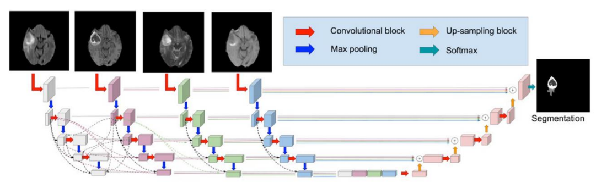

模型参数结构：

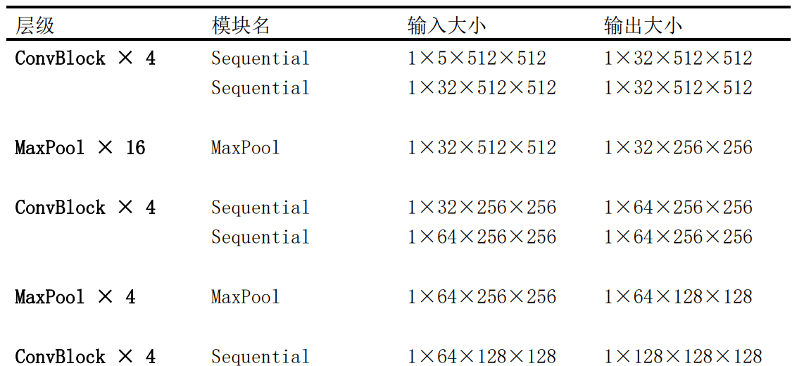
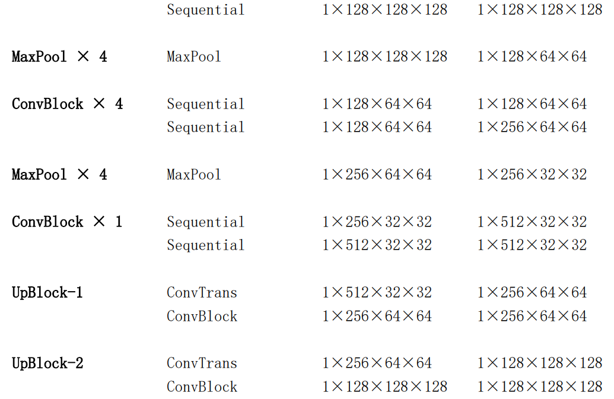
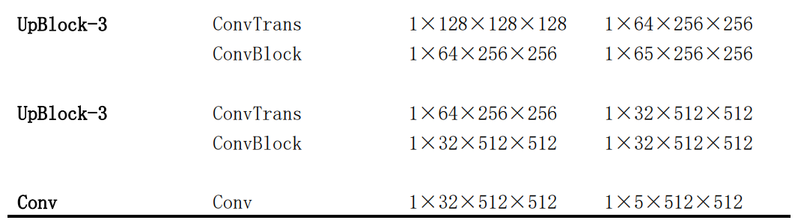

训练环境：

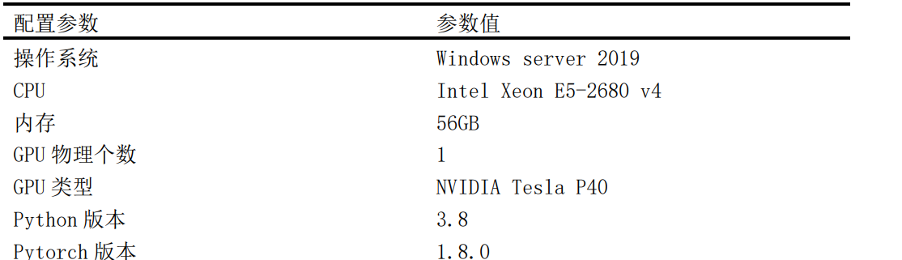


神经网络结构参数：

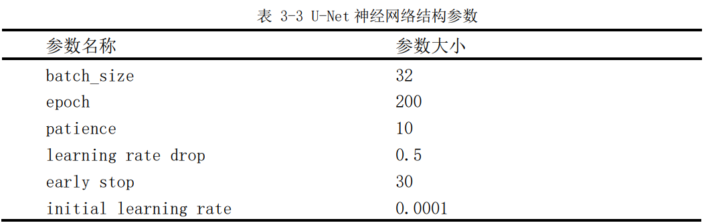

- `batch_size`：每次训练使用的样本数。
- `epoch`：完整遍历训练数据的轮数。
- `patience`：验证指标连续无提升时允许等待的轮数。
- `learning rate drop`：训练过程中学习率下降策略。
- `early stop`：验证性能不再提升时提前结束训练。
- `initial learning rate`：初始学习率，实验使用 Adam 优化器。

实验展示中，从左到右为 Flair、T1、T1c、T2、模型预测掩模和真实掩模：

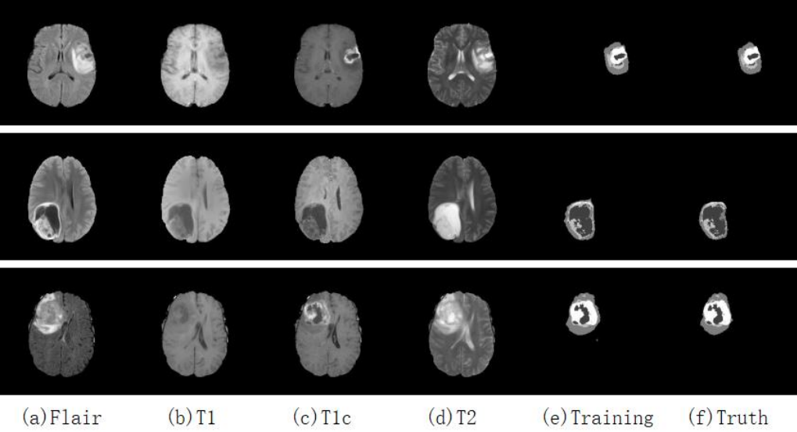

历史实验记录中的 IoU：标签 0 为 99.6%，标签 1、2、3、4 分别为 78.4%、83.9%、75% 和 87.2%。这些数值来自既有实验展示，不代表医疗产品性能承诺。

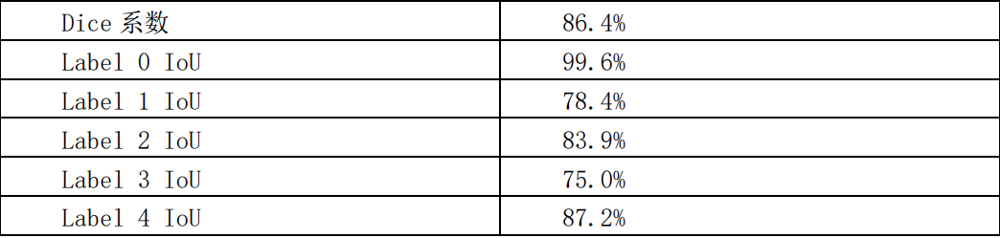

## 设计资料

- [系统架构图](designSystem/BrainU-backend/img/system.png)
- [业务流程图](designSystem/BrainU-backend/img/process.png)
- [模块设计图](designSystem/BrainU-backend/img/design.png)
- [系统用例图](designSystem/BrainU-backend/img/use.png)
- [肿瘤分割时序图](designSystem/BrainU-backend/img/timep.png)

## 界面截图

### 登录


### 数据添加

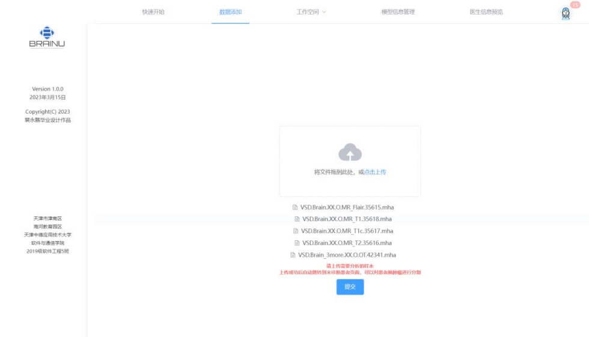
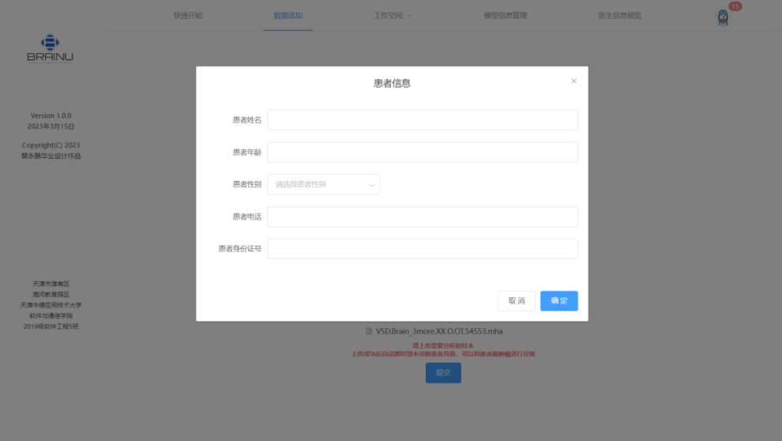

### 工作空间

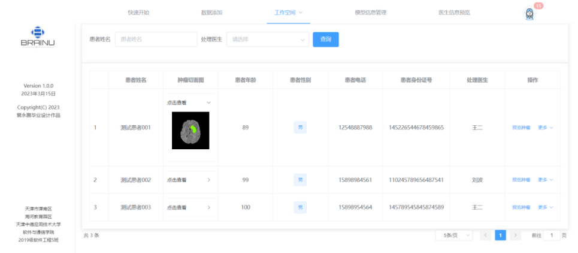
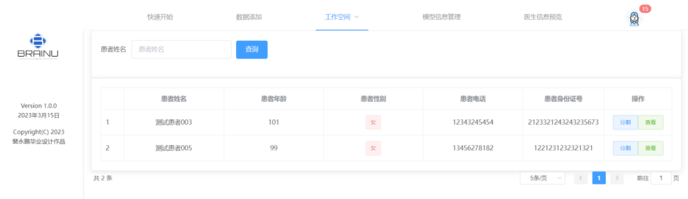

### 肿瘤交互

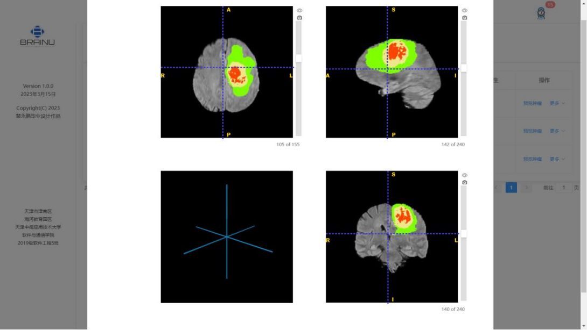

### 模型与医生管理

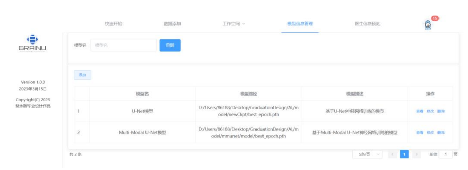
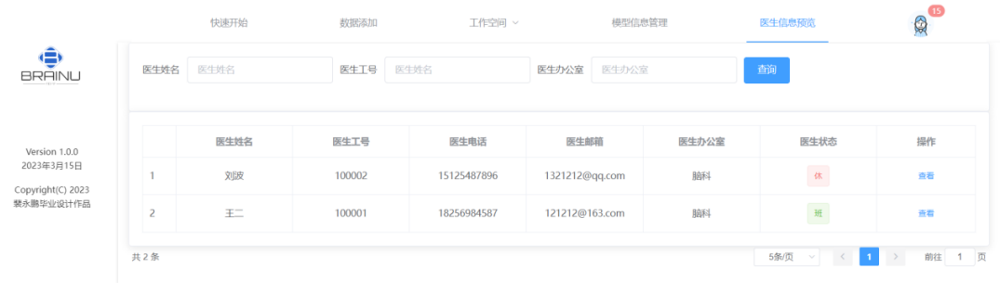

## 作者与反馈

- GitHub：[@change-everything](https://github.com/change-everything)
- Email：pyptsguas@163.com

